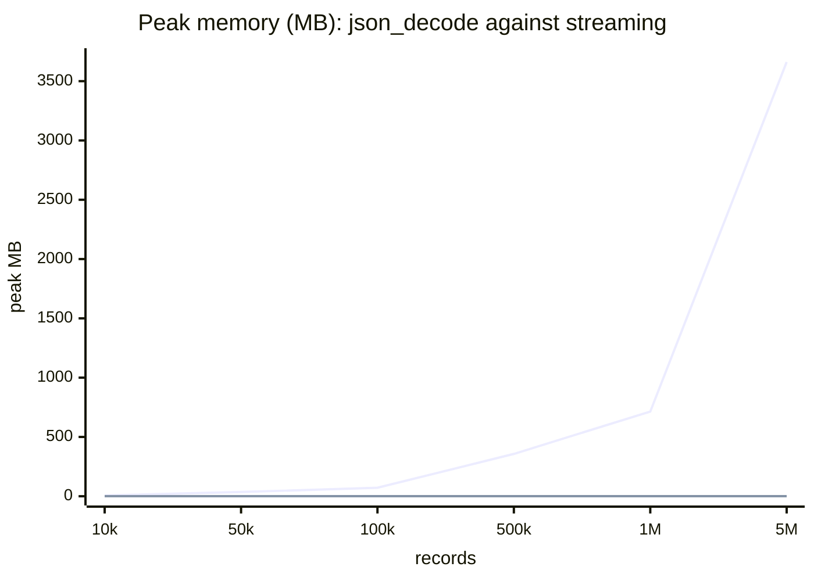
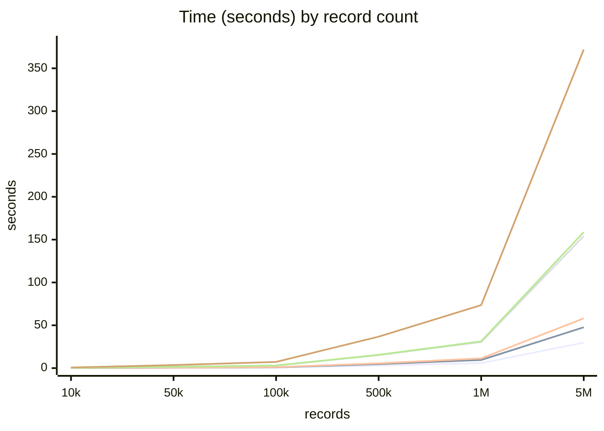

# Benchmarks

Six libraries and plain `json_decode()`, over the same documents, from ten thousand records to five
million. One machine, 2026-09-06, PHP 8.4, opcache off, median of 2 runs. Yours will differ — what
carries over is the **shape** of each line, not the milliseconds.

Reproducible from the repository:

```bash
php bin/benchmark.php --runs=2 --sizes=10000,50000,100000,500000,1000000,5000000
```

Back to the [README](README.md).

## The question worth asking first

**Does the file fit in memory?** If it does, `json_decode()` is faster than every streaming reader
here — ten to twelve times faster than this one, at every size — and you should use it. Streaming buys one thing:
memory that does not grow with the file. It is paid for in time.

`json_decode()` on the whole file, same documents:

| Records | File | Time | Peak memory | Under a 512 MB limit |
|---:|---:|---:|---:|:--|
| 10k | 1 MB | 6 ms | 7.2 MB | fine |
| 50k | 5 MB | 25 ms | 35.7 MB | fine |
| 100k | 10 MB | 49 ms | 71.5 MB | fine |
| 500k | 51 MB | 246 ms | 356.8 MB | fine |
| 1M | 103 MB | 496 ms | 714.0 MB | **out of memory** |
| 5M | 528 MB | 2 897 ms | **3 661.5 MB** | **out of memory** |

It needs about **6.9× the size of the file**, every time, and that ratio does not improve. Give PHP
4 GB and it will read the 528 MB document in under three seconds. Give it the 512 MB that many
deployments run with, and it stops at a file of roughly 70 MB.

`PhpJsonChunk` reads that same 528 MB document at **0.15 MB**, in 29.7 s.

## Memory: flat against climbing



The flat line along the bottom is the whole product. It is 0.15 MB at ten thousand records and
0.15 MB at five million, because memory follows the biggest single element, never the length of the
file. Every streaming reader in this comparison has a flat line here; they differ only in how low it
sits — from 0.01 MB to 0.31 MB — and all of them are invisible against `json_decode()`.

## Time: every line is straight, the slope is what differs



Nothing here degrades as the file grows — every line is straight, so a document ten times bigger takes
ten times longer and no worse. What separates them is the constant, and the spread is wide: at five
million records the range is 30 s to 372 s.

`PhpJsonChunk` reads **5.9 ms per thousand records** at every size measured:

| Records | 10k | 50k | 100k | 500k | 1M | 5M |
|---|---:|---:|---:|---:|---:|---:|
| ms per 1 000 records | 5.71 | 5.79 | 6.16 | 5.90 | 5.89 | 5.94 |

## The numbers

**Every number is one complete read**: open the file, walk every record to the end, hand each one back
as a PHP value. Not a chunk, not a sample, and no `chunkSize` — the loop is item by item. So the
5 000 000 row is five million records read, and 29 700 ms over five million records is **5.9 µs per
record**.

Time in milliseconds, with the wall-clock reading beneath it once milliseconds stop being legible.
`json_decode()` is in the table because it is what everyone actually compares against — it is not a
streaming reader, and its column is there to be beaten on memory, not on speed.

| Records | `json_decode()` | PhpJsonChunk | JsonMachine | crocodile2u | Salsify¹ | JsonCollectionParser | JsonDecodeStream |
|---:|---:|---:|---:|---:|---:|---:|---:|
| 10k | *6* | **57.1** | 91.7 | 118.5 | 316.1 | 297.1 | 752.1 |
| 50k | *25* | **289.6** | 453.6 | 542.7 | 1 473.6 | 1 536.9 | 3 544.1 |
| 100k | *49* | **615.7** | 936.7 | 1 118.9 | 2 981.9 | 3 047.5 | 7 251.8 |
| 500k | *246* | **2 950.7** | 4 684.3 | 5 628.1 | 15 168.3<br><sub>15 s</sub> | 15 502.5<br><sub>16 s</sub> | 36 726.6<br><sub>37 s</sub> |
| 1M | *496* | **5 889.2** | 9 495.9 | 11 356.2<br><sub>11 s</sub> | 30 462.4<br><sub>30 s</sub> | 31 307.9<br><sub>31 s</sub> | 73 515.0<br><sub>1m 13s</sub> |
| 5M | *2 897*<br><sub>2.9 s</sub> | **29 700.4**<br><sub>**30 s**</sub> | 47 667.1<br><sub>48 s</sub> | 58 070.8<br><sub>58 s</sub> | 154 132.4<br><sub>2m 34s</sub> | 158 697.6<br><sub>2m 38s</sub> | 371 922.3<br><sub>6m 11s</sub> |
| **peak MB** | **7.2 → 3 661** | 0.15 | 0.31 | **0.01** | 0.03–0.04 | 0.03–0.04 | 0.04 |

Five million records is where the spread stops being an abstraction: half a minute against six
minutes, over the same 528 MB file.

**Read the last row across, not down.** Every streaming reader holds the same memory at ten thousand
records as at five million — two of them wander by a hundredth of a megabyte between sizes, which is
rounding, not growth. `json_decode()` has an arrow instead of a number, because its memory *is* the
file: 6.9× of it, every time. That is the only difference in this table that changes what is
possible, rather than what is quick.

`json_decode()` is roughly **ten to twelve times faster** than this library at every size where it
runs at all — 9.5× at ten thousand records, 12.6× at a hundred thousand, 10.3× at five million. It
stops running at a file of roughly 70 MB under a 512 MB limit, and that is the whole reason the rest
of this table exists.

Among the streaming readers, `PhpJsonChunk` is the fastest at every size, by about 1.6× over the next
one. It is **not** the thinnest: `crocodile2u` holds a fifteenth of the memory and three others hold a
quarter of it. What 0.15 MB buys is a decoded PHP value per item and a key path to reach it; a parser
that hands you events rather than values has less to keep.

<sub>¹ `salsify` is a SAX parser and is not doing the same work: the listener in the benchmark counts
elements without ever building one, so its time is a floor rather than a like-for-like measurement.
Every other column hands back a PHP value for each element, and the benchmark iterates all of them.</sub>

## Method

- Dataset: synthetic root-array JSON, identical for every parser, five fields per record.
- Metric: wall-clock time around the **whole** read — constructing the reader, opening the file, and
  iterating every record to the end — plus the peak memory delta over that span. Nothing is amortised
  and nothing is sampled.
- No chunking: every parser is asked for one item at a time, which is the shape they all share.
- Each size is generated once and read by every parser in turn; run order is shuffled between runs.
- `json_decode()` is measured separately, one process per size, so a run that exhausts memory does not
  take the others with it. That is also how the 512 MB column was produced.

### What each parser is asked to do

Five of the six hand back a PHP value for every element, and the benchmark iterates all of them:
`PhpJsonChunk`, `JsonMachine`, `JsonDecodeStream`, `JsonCollectionParser` and
`crocodile2u/json-streamer`.

**`salsify/json-streaming-parser` is not doing the same work.** It is a SAX-style parser: it reports
events, and the benchmark's listener counts root-array elements without ever assembling one. Its
number is a floor — materialising the items would only add to it.

One difference that turned out not to matter: `JsonMachine` yields `stdClass` by default where the
others yield arrays. Re-measured with `ExtJsonDecoder(true)` so that it yields arrays too, 100k
records took 1 078 ms against 1 053 ms with objects — a 2% difference, which is noise at this scale
and not where the gap comes from.

## Compared against

- [`PhpJsonChunk`](https://github.com/michaelalexeevweb/php-json-chunk)
- [`JsonMachine`](https://github.com/halaxa/json-machine)
- [`crocodile2u/json-streamer`](https://packagist.org/packages/crocodile2u/json-streamer)
- [`salsify/json-streaming-parser`](https://github.com/salsify/jsonstreamingparser)
- [`MAXakaWIZARD/JsonCollectionParser`](https://github.com/MAXakaWIZARD/JsonCollectionParser)
- [`klkvsk/json-decode-stream`](https://github.com/klkvsk/json-decode-stream)
