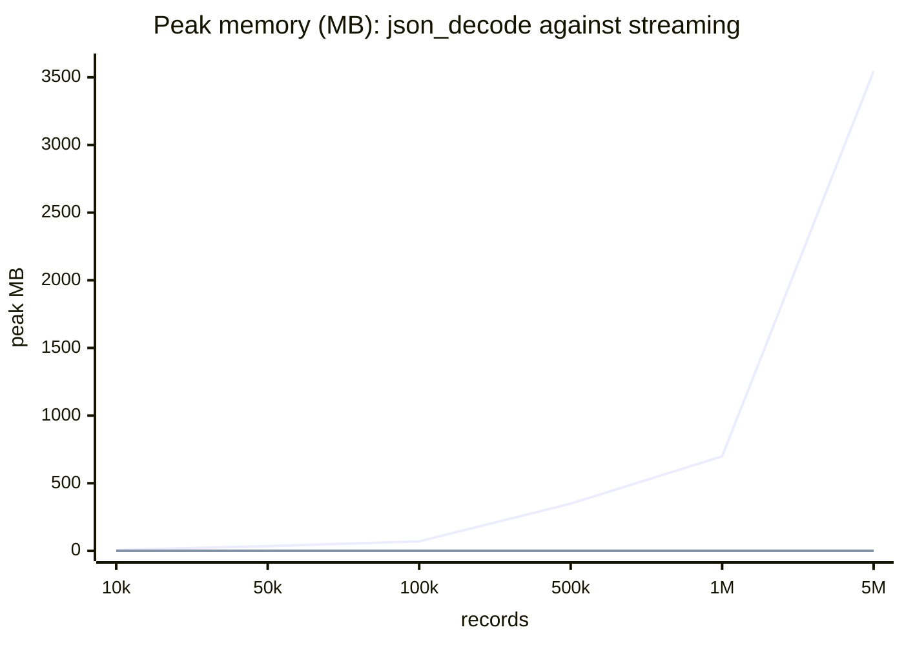
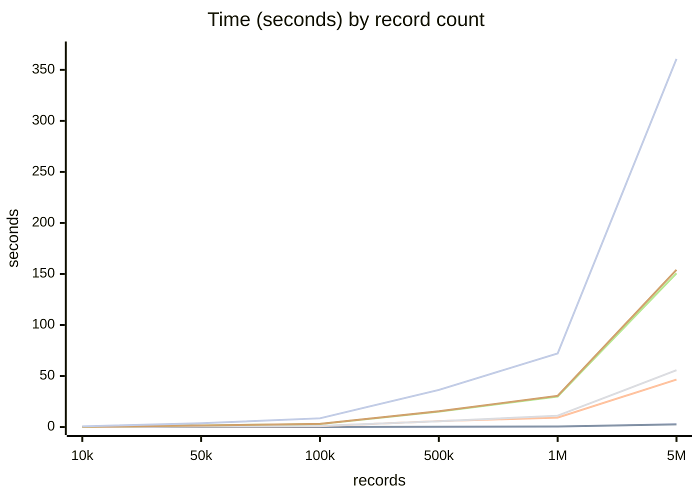

# Benchmarks

Six libraries and plain `json_decode()`, over the same documents, from ten thousand records to five
million. One machine, 2026-11-22, PHP 8.4, opcache off, median of 2 runs (`json_decode()`: of 3, and
one at five million). Yours will differ — what carries over is the **shape** of each line, not the
milliseconds.

**Which version.** The tables were taken with 1.12.0. On 2026-11-23, 1.18.1 was measured against
1.12.0 on the same machine, the two runs taking turns, at every size from a hundred thousand records
to five million: the same times within noise — 55 ms against 55–58 ms at 100 000 records, 2.79–2.83 s
against 2.76–2.91 s at five million. Nothing since has changed how fast a list is read; what did change
is listed in the [changelog](CHANGELOG.md).

Reproducible from the repository:

```bash
php bin/benchmark.php --runs=2 --sizes=10000,50000,100000,500000,1000000,5000000
# every BlockSize of this library, five runs each
php bin/benchmark.php --runs=5 --sizes=10000,50000,100000,500000,1000000,5000000 --block-sizes --parsers=PhpJsonChunk
```

Back to the [README](README.md).

## The question worth asking first

**Does the file fit in memory?** If it does, `json_decode()` is still the simplest thing to use — but
it is no longer much faster: 1.8× at ten thousand records, 1.2× to 1.4× from fifty thousand to a
million, and at five million records this library is **faster** than it, 2.66 s against 2.95 s.
Streaming used to be paid for in time. Since 1.10.0 it barely is.

`json_decode()` on the whole file, same documents:

| Records | File | Time | Peak memory | Under a 512 MB limit |
|---:|---:|---:|---:|:--|
| 10k | 0.8 MB | 3.6 ms | 7.1 MB | fine |
| 50k | 3.9 MB | 20 ms | 35.1 MB | fine |
| 100k | 7.9 MB | 42 ms | 70.2 MB | fine |
| 500k | 39.9 MB | 209 ms | 349.3 MB | fine |
| 1M | 80.0 MB | 445 ms | 698.8 MB | **out of memory** |
| 5M | 404.3 MB | 2 951 ms | **3 545.9 MB** | **out of memory** |

It needs about **9× the size of the file**, every time — between 8.7× and 8.9× at every size
measured — and that ratio does not improve. Give PHP 4 GB and it reads the 404 MB document in under
three seconds. Give it the 512 MB that many deployments run with, and it stops at a file of roughly
58 MB.

`PhpJsonChunk` reads that same 404 MB document at **0.16 MB**, in 2.66 s.

## Memory: flat against climbing


```mermaid
xychart-beta
    title "Peak memory (MB): json_decode against streaming"
    x-axis "records" [10k, 50k, 100k, 500k, 1M, 5M]
    y-axis "peak MB" 0 --> 3600
    line "json_decode()" [7.1, 35.1, 70.2, 349.3, 698.8, 3545.9]
    line "PhpJsonChunk" [0.16, 0.16, 0.16, 0.16, 0.16, 0.16]
```

The flat line along the bottom is the whole product. It is 0.16 MB at ten thousand records and
0.16 MB at five million, because memory follows the biggest single element — and the 4 KB run of
elements decoded at once — never the length of the file. Every streaming reader in this comparison has
a flat line here; they differ only in how low it sits — from 0.01 MB to 0.31 MB — and all of them are
invisible against `json_decode()`.

## Time: every line is straight, the slope is what differs


```mermaid
xychart-beta
    title "Time (seconds) by record count"
    x-axis "records" [10k, 50k, 100k, 500k, 1M, 5M]
    y-axis "seconds" 0 --> 370
    line "json_decode()" [0.004, 0.02, 0.04, 0.21, 0.45, 2.95]
    line "PhpJsonChunk" [0.01, 0.03, 0.05, 0.27, 0.54, 2.66]
    line "JsonMachine" [0.10, 0.48, 0.95, 5.77, 9.24, 46.56]
    line "crocodile2u" [0.12, 0.60, 1.16, 5.67, 11.14, 55.72]
    line "Salsify" [0.31, 1.60, 3.02, 15.11, 29.91, 150.68]
    line "JsonCollectionParser" [0.32, 1.57, 3.11, 15.47, 30.61, 154.11]
    line "JsonDecodeStream" [0.74, 3.73, 8.58, 36.37, 72.13, 360.79]
```

Nothing here degrades as the file grows — every line is straight, so a document ten times bigger takes
ten times longer and no worse. What separates them is the constant, and the spread is wide: at five
million records the range is 2.7 s to 361 s. `PhpJsonChunk` and `json_decode()` lie on top of each other
along the bottom.

`PhpJsonChunk` reads **about half a millisecond per thousand records** at every size measured:

| Records | 10k | 50k | 100k | 500k | 1M | 5M |
|---|---:|---:|---:|---:|---:|---:|
| ms per 1 000 records | 0.64 | 0.56 | 0.54 | 0.55 | 0.54 | 0.53 |

## The numbers

**Every number is one complete read**: open the file, walk every record to the end, hand each one back
as a PHP value. Not a chunk, not a sample, and no `chunkSize` — the loop is item by item. So the
5 000 000 row is five million records read, and 2 660 ms over five million records is **0.53 µs
per record**.

Time in milliseconds, with the wall-clock reading beneath it once milliseconds stop being legible.
`json_decode()` is in the table because it is what everyone actually compares against — it is not a
streaming reader, and its column is there to be beaten on memory.

| Records | `json_decode()` | PhpJsonChunk | JsonMachine | crocodile2u | Salsify¹ | JsonCollectionParser | JsonDecodeStream |
|---:|---:|---:|---:|---:|---:|---:|---:|
| 10k | *3.6* | **6.4** | 97.9 | 122.2 | 308.9 | 322.9 | 742.5 |
| 50k | *20.1* | **27.8** | 484.6 | 601.3 | 1 597.6 | 1 573.0 | 3 726.1 |
| 100k | *41.7* | **53.9** | 946.0 | 1 157.9 | 3 018.0 | 3 105.5 | 8 579.0 |
| 500k | *208.9* | **272.5** | 5 770.1 | 5 668.7 | 15 105.1<br><sub>15 s</sub> | 15 474.5<br><sub>15 s</sub> | 36 369.9<br><sub>36 s</sub> |
| 1M | *445.0* | **537.3** | 9 240.6 | 11 139.8<br><sub>11 s</sub> | 29 905.3<br><sub>30 s</sub> | 30 612.2<br><sub>31 s</sub> | 72 130.3<br><sub>1m 12s</sub> |
| 5M | *2 951.0*<br><sub>3.0 s</sub> | **2 659.6**<br><sub>**2.7 s**</sub> | 46 564.9<br><sub>47 s</sub> | 55 719.3<br><sub>56 s</sub> | 150 678.4<br><sub>2m 31s</sub> | 154 110.3<br><sub>2m 34s</sub> | 360 794.6<br><sub>6m 1s</sub> |
| **peak MB** | **7.1 → 3 546** | 0.16 | 0.31 | **0.01** | 0.03–0.04 | 0.03–0.04 | 0.04 |

Five million records is where the spread stops being an abstraction: under three seconds against six
minutes, over the same 404 MB file.

**Read the last row across, not down.** Every streaming reader holds the same memory at ten thousand
records as at five million — two of them wander by a hundredth of a megabyte between sizes, which is
rounding, not growth. `json_decode()` has an arrow instead of a number, because its memory *is* the
file: close to 9× of it, every time. That is the only difference in this table that changes what is
possible, rather than what is quick.

`json_decode()` is faster than this library at small sizes and barely faster in the middle — 1.8× at
ten thousand records, 1.3× at a hundred thousand, 1.2× at a million — and slower at five million. It
stops running at a file of roughly 58 MB under a 512 MB limit, and that is the whole reason the rest of
this table exists.

Among the streaming readers, `PhpJsonChunk` is the fastest at every size — **15 to 21 times** quicker
than JsonMachine, the next one along: 15× at ten thousand records, 17.6× at a hundred thousand, 17.5× at
five million.

It is **not** the thinnest: `crocodile2u` holds a sixteenth of the memory and three others hold about a
quarter of it. What 0.16 MB buys is a decoded PHP value per item and a key path to reach it; a parser
that hands you events rather than values has less to keep.

<sub>¹ `salsify` is a SAX parser and is not doing the same work: the listener in the benchmark counts
elements without ever building one, so its time is a floor rather than a like-for-like measurement.
Every other column hands back a PHP value for each element, and the benchmark iterates all of them.</sub>

## Every reader and every block size

The same documents again, with this library at each of its [block sizes](README.md#block-size-memory-against-speed)
— time in milliseconds. Its nine rows come from their own run, five rounds each; `Kb64`, which every
earlier figure on this page was measured with, read 100 000 records in 54.0 ms there and 53.9 ms in the
run above, so the rows sit together fairly.

| Reader | 10k | 50k | 100k | 500k | 1M | 5M | peak MB |
|---|---:|---:|---:|---:|---:|---:|---:|
| `json_decode()` | *3.6* | *20.1* | *41.7* | *208.9* | *445.0* | *2 951* | 7.1 → 3 546 |
| **PhpJsonChunk `Auto`** (default) | 5.3 | 26.5 | 54.2 | 272.4 | 549.9 | 2 757 | 0.15–0.16 |
| PhpJsonChunk `Kb8` | 6.3 | 30.2 | 62.1 | 314.2 | 656.9 | 3 097 | **0.10** |
| PhpJsonChunk `Kb16` | 5.8 | 28.4 | 57.3 | 300.8 | 578.9 | 2 904 | 0.11 |
| PhpJsonChunk `Kb32` | 5.5 | 27.2 | 55.3 | 284.4 | 544.9 | 2 815 | 0.12 |
| PhpJsonChunk `Kb64` | 5.4 | 26.7 | 54.0 | 267.0 | 542.7 | 2 736 | 0.15–0.16 |
| PhpJsonChunk `Kb128` | 5.3 | 26.3 | 52.9 | 275.6 | 547.5 | 2 737 | 0.27–0.29 |
| PhpJsonChunk `Kb256` | 5.3 | 26.1 | 53.2 | 266.1 | 543.5 | 2 640 | 0.52–0.55 |
| PhpJsonChunk `Kb512` | 5.2 | 26.2 | 52.8 | 264.2 | 528.9 | 2 675 | 1.02–1.04 |
| PhpJsonChunk `Mb1` | 5.2 | 26.1 | 52.5 | 273.6 | 530.3 | 2 668 | 1.09–2.05 |
| JsonMachine | 97.9 | 484.6 | 946.0 | 5 770 | 9 241 | 46 565 | 0.31 |
| crocodile2u | 122.2 | 601.3 | 1 158 | 5 669 | 11 140 | 55 719 | 0.01 |
| Salsify¹ | 308.9 | 1 598 | 3 018 | 15 105 | 29 905 | 150 678 | 0.03–0.04 |
| JsonCollectionParser | 322.9 | 1 573 | 3 106 | 15 474 | 30 612 | 154 110 | 0.03–0.04 |
| JsonDecodeStream | 742.5 | 3 726 | 8 579 | 36 370 | 72 130 | 360 795 | 0.04 |

On records this small the block hardly moves the time — `Kb8` is 15% behind at worst, and everything
from 32 KB up is within a few percent — while memory goes from 0.10 MB to 2 MB. `Auto` stays at 64 KB on
such records and reads like `Kb64`. Where the block decides the time is large elements; the README
[measures that](README.md#block-size-memory-against-speed).

## An index, and workers side by side

Reproducible with:

```bash
php bin/benchmark-index.php --workers=1,2,4,6,8,12,16
```

The same five million records, 1.19.0's index and 1.20.0's workers, one run on a quiet machine
(2026-11-23, twelve cores: six performance, six efficiency):

| | time |
|---|---:|
| building the index — 4 929 checkpoints, saved as 94 KB | 2.17 s |
| `getNth(4_999_999)`, no index | 2.38 s |
| `readFrom($index, 4_999_999, 1)` | 0.0002 s |

One pass with every record encoded and hashed — light work, as any real handler's is at the least:

| workers | time | against a plain read |
|---:|---:|---:|
| none (a plain read) | 4.54 s | |
| 1 | 4.96 s | 0.9× |
| 2 | 2.54 s | 1.8× |
| 4 | 1.30 s | 3.5× |
| 6 | 0.88 s | 5.1× |
| 8 | 0.75 s | 6.0× |
| 12 | 0.62 s | 7.3× |
| 16 | 0.62 s | 7.3× |

It grows with the workers up to the cores and stops there. One worker is slower than a plain loop — a
call per record, and a fork. A handler that waits on a database or the network gains from more workers
than cores; this one does not wait.

`readInParallel()` — the handler called once a part, returning how many it read — measured in the same
run as `forEachInParallel()` (a later one, load around five): 1.22 s against 1.30 s at four workers,
0.83 s against 0.90 s at six, 0.61 s against 0.65 s at twelve. One worker is as fast as a plain loop
with it, the handler called once instead of once a record.

### The same records as NDJSON

2.1.0's `indexValues()`, in the same run: the five million records one to a line, 404 MB.

| | time |
|---|---:|
| building the index — 3 235 checkpoints | 2.58 s |
| `readValues($path, 1, 4_999_999)`, no index | 2.69 s |
| `readFrom($index, 4_999_999, 1)` | 0.0001 s |

| workers, `readInParallel()` | time | against a plain read |
|---:|---:|---:|
| none (a plain `readValues()`) | 4.44 s | |
| 1 | 4.87 s | 0.9× |
| 2 | 2.50 s | 1.8× |
| 4 | 1.28 s | 3.5× |
| 6 | 0.88 s | 5.1× |
| 8 | 0.74 s | 6.0× |
| 12 | 0.65 s | 6.8× |

Fewer checkpoints than the list's: lines are taken up to 64 KB at a time, and a checkpoint can only fall
where a batch starts — about every 1 500 lines here, not every 1 000.

### Building an NDJSON index with workers

2.3.0's `indexValues($path, workers: N)`, the same five million lines (404 MB), best of two, load
around five:

| workers | building the index | against one process |
|---:|---:|---:|
| 1 | 2.65 s | |
| 2 | 1.38 s | 1.9× |
| 4 | 0.71 s | 3.7× |
| 6 | 0.48 s | 5.5× |
| 8 | 0.44 s | 6.0× |
| 12 | 0.37 s | 7.2× |

### `readValues()`: one to a line, and pretty-printed

```bash
php bin/benchmark-values.php
```

| 200 000 documents (16 MB one to a line) | 2.0.0 | 2.1.0 |
|---|---:|---:|
| one per line, `fgets()` + `json_decode()` | 88 ms | 84 ms |
| one per line, `readValues()` | 182 ms | 100 ms |
| pretty-printed one after another, `readValues()` | 205 ms | 180 ms |

2.0.0 measured from a copy of its source in the same session, load around fourteen; 2.1.0 on a quiet
machine. Within one run the two stood at 182 and 104 ms.

A run with the machine busy — a virtual machine taking two cores — gave 5.2× at six workers and *less* at
twelve than at eight: the workers had no cores to run on. Measure on a quiet machine.

## Method

- Dataset: synthetic root-array JSON, identical for every parser, four fields per record:
  `{"id":1,"name":"test","surname":"test","createdAt":"2023-01-01T00:00:00.000Z"}`.
- Metric: wall-clock time around the **whole** read — constructing the reader, opening the file, and
  iterating every record to the end — plus the peak memory delta over that span. Nothing is amortised
  and nothing is sampled.
- No chunking: every parser is asked for one item at a time, which is the shape they all share.
- Each size is generated once and read by every parser in turn; run order is shuffled between runs.
- `json_decode()` is measured separately, one process per size, so a run that exhausts memory does not
  take the others with it. That is also how the 512 MB column was produced.

### What each parser is asked to do

Five of the six hand back a PHP value for every element, and the benchmark iterates all of them:
`PhpJsonChunk`, `JsonMachine`, `JsonDecodeStream`, `JsonCollectionParser` and
`crocodile2u/json-streamer`.

**`salsify/json-streaming-parser` is not doing the same work.** It is a SAX-style parser: it reports
events, and the benchmark's listener counts root-array elements without ever assembling one. Its
number is a floor — materialising the items would only add to it.

One difference that turned out not to matter: `JsonMachine` yields `stdClass` by default where the
others yield arrays. Re-measured with `ExtJsonDecoder(true)` so that it yields arrays too, 100k
records took 1 078 ms against 1 053 ms with objects — a 2% difference, which is noise at this scale
and not where the gap comes from.

## Compared against

- [`PhpJsonChunk`](https://github.com/michaelalexeevweb/php-json-chunk)
- [`JsonMachine`](https://github.com/halaxa/json-machine)
- [`crocodile2u/json-streamer`](https://packagist.org/packages/crocodile2u/json-streamer)
- [`salsify/json-streaming-parser`](https://github.com/salsify/jsonstreamingparser)
- [`MAXakaWIZARD/JsonCollectionParser`](https://github.com/MAXakaWIZARD/JsonCollectionParser)
- [`klkvsk/json-decode-stream`](https://github.com/klkvsk/json-decode-stream)
